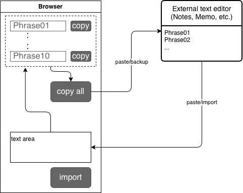
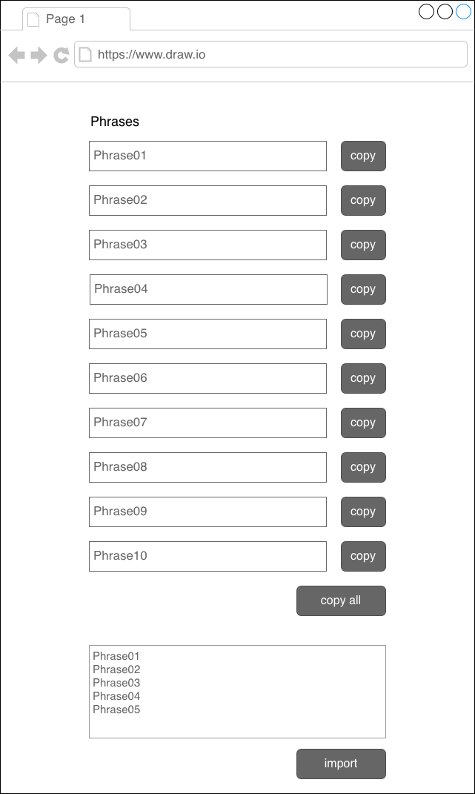
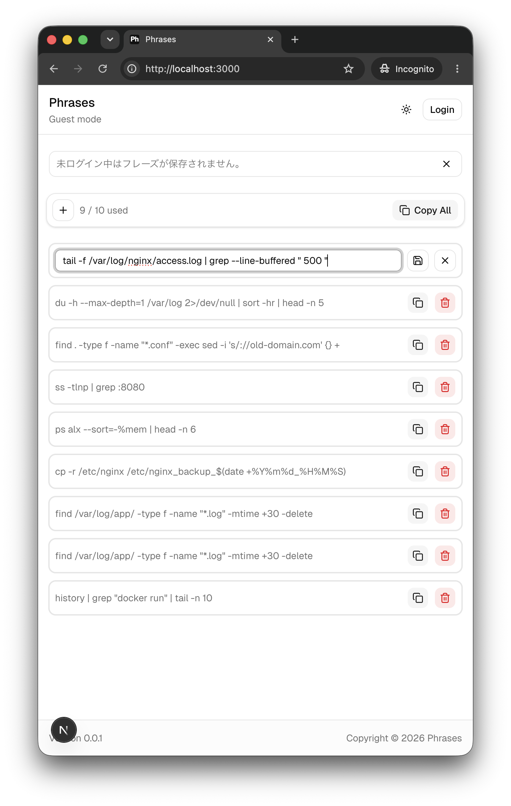
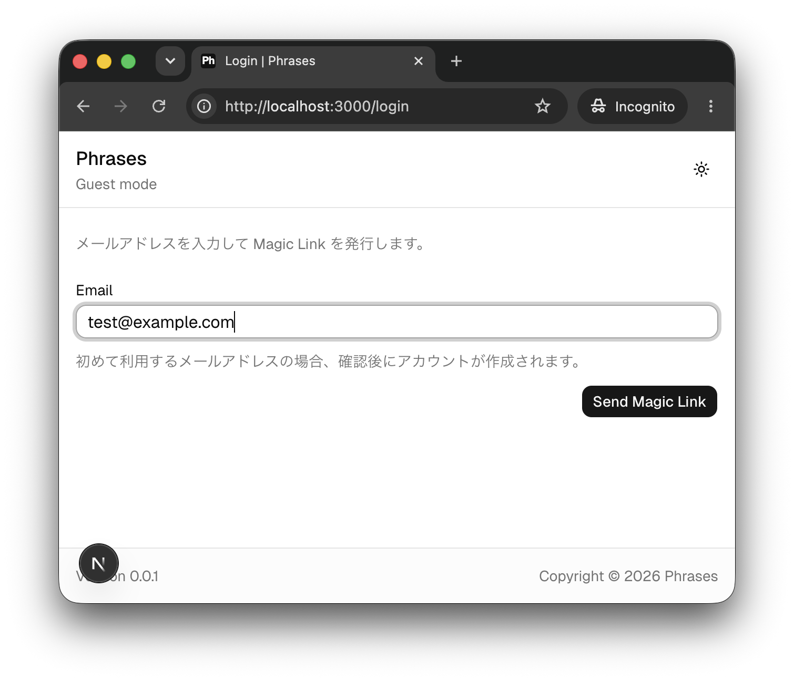
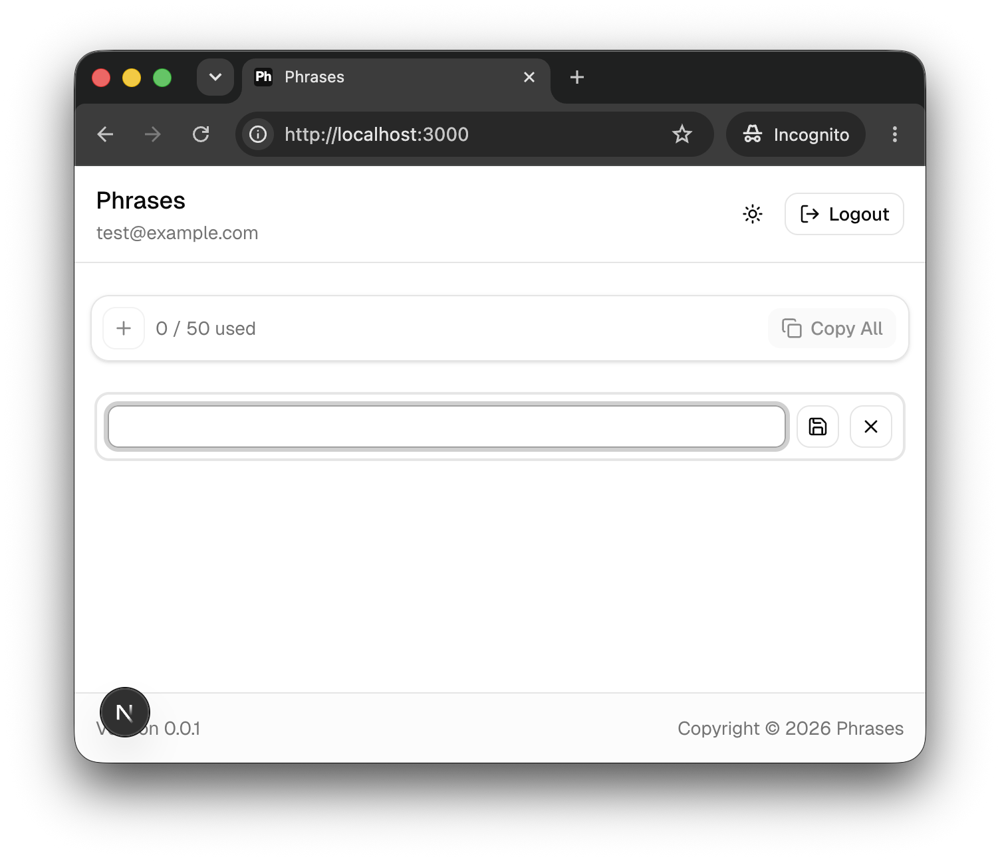

# Phrase Copy App

This app is a lightweight tool for managing and copying your frequently used phrases.

## Features

- Save and edit phrases
- Copy one phrase or all phrases
- Magic Link authentication
- Guest mode with a phrase limit
- Saves phrases to the database after login
- Responsive UI with dark mode

## Tech Stack

- Frontend: Next.js, React, TypeScript, Tailwind CSS, shadcn/ui
- Backend: FastAPI, MySQL
- Auth: Magic Link, HttpOnly cookie
- Ops: Docker Compose, Makefile (`prod` / `dev` targets)

## Environment Variables

Environment variables are managed with example files.

- `infra/.env.local.example`, `infra/.env.prod.example` contain example values for Docker, the database, and the backend.
- Local `.env` files are ignored by Git.

For local development, copy the example files and update the values.

```bash
# Backend and database
cp infra/.env.local.example infra/.env.local
```

Do not commit real secrets or local passwords.

## Getting Started

```bash
# Run from the project root (after creating infra/.env.local)
make deploy-dev
```

Open `http://localhost:3000` in your browser.

Useful follow-ups:

```bash
make ps-dev
make logs-dev
make restart-dev
make down-dev
```

### Local Magic Link Email (Mailpit)

With `EMAIL_BACKEND=smtp` in `infra/.env.local`, magic link emails are delivered to [Mailpit](https://github.com/axllent/mailpit) instead of AWS SES. Request a link at `/login`, then open `http://localhost:8025` to read the message and click the login link. Set `APP_ORIGIN=http://localhost:3000` so links in the email point to your local frontend. To skip email and show a dev link on the login page instead, use `EMAIL_BACKEND=dev`.

## Production Start

```bash
# Run from the project root
cp infra/.env.prod.example infra/.env.prod
# Edit .env.prod before starting.

make deploy-prod
```

`deploy-prod` runs `git pull --ff-only`, rebuilds and starts containers in the background, then prunes unused images.

## Makefile Operations

Day-to-day Docker Compose commands are wrapped in the root [`Makefile`](Makefile) so local and production use the same target names.

| Target                         | Purpose                                      |
| ------------------------------ | -------------------------------------------- |
| `deploy-prod`                  | Pull latest code → build & up → prune images |
| `deploy-dev`                   | Build & up for local development             |
| `logs-prod` / `logs-dev`       | Follow container logs                        |
| `down-prod` / `down-dev`       | Stop containers                              |
| `restart-prod` / `restart-dev` | Recreate containers (see note below)         |
| `ps-prod` / `ps-dev`           | Show running services                        |

Design choices worth noting:

- **Separate `prod` / `dev` variables and targets** — compose files and env files stay explicit; the target name tells you which environment you are touching.
- **Composite `deploy-prod`** — one SSH command covers the common deploy loop on a server.
- **`restart-*` uses `up -d --force-recreate`, not `docker compose restart`** — plain `restart` ignores Compose healthchecks, so the backend can boot before MySQL is ready. Recreate keeps `depends_on` / healthcheck ordering.

## Design Process

### 1. Interaction Flow



### 2. Screen Rough



### Notes

- “Copy All” copies all phrases as newline-separated text.
- Backup and import are text-based to allow easy use on mobile devices
  (e.g., saving to a notes app).

## Screenshots





## Why I Built This

I often work with Linux commands during system maintenance.
I wanted a simple way to prepare and copy frequently used commands without mistakes.

This app was built to make copying commands easier, faster, and safer.

## Future Improvements

User features:

- Search phrases
- Reorder phrases
- Add genres and tags
- Import and export phrases with plain text or CSV
- Support multiple languages
- Add account deletion

Development and operations:

- Extend Makefile ops (`help`, backups, per-service logs)
- Add external storage integration, such as S3
- Add an admin page
- Add CI/CD
