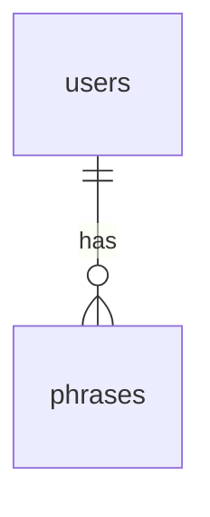

# Mermaid ER図 サンプル

このディレクトリは、`docs/design-docs` 本体を触らずに Mermaid 記法を練習するための見本です。

## 使い方

1. `01_er-basic.md` を開く
2. コードブロック内の `erDiagram` を少しずつ書き換える
3. プレビューを見ながら、関係線・カラム注釈の意味を確認する

## 最短テンプレート

## 読み方のコツ

- `users ||--o{ phrases` は「1ユーザーに対して0件以上のフレーズ」の意味
- 左右どちらに置いても意味は同じだが、主語を左に置くと読みやすい
- カラム定義は `テーブル名 { ... }` 内に書く
- `PK` `FK` `UNIQUE` `NOT NULL` は注釈として書くと、設計意図が伝わりやすい

