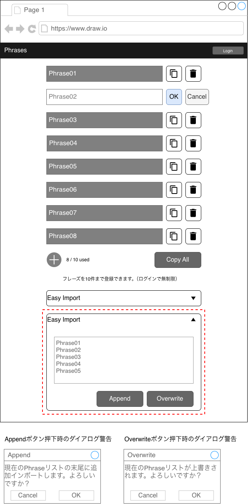
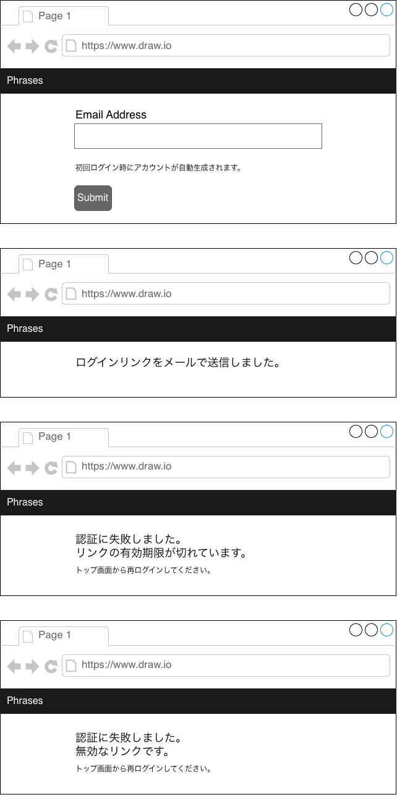
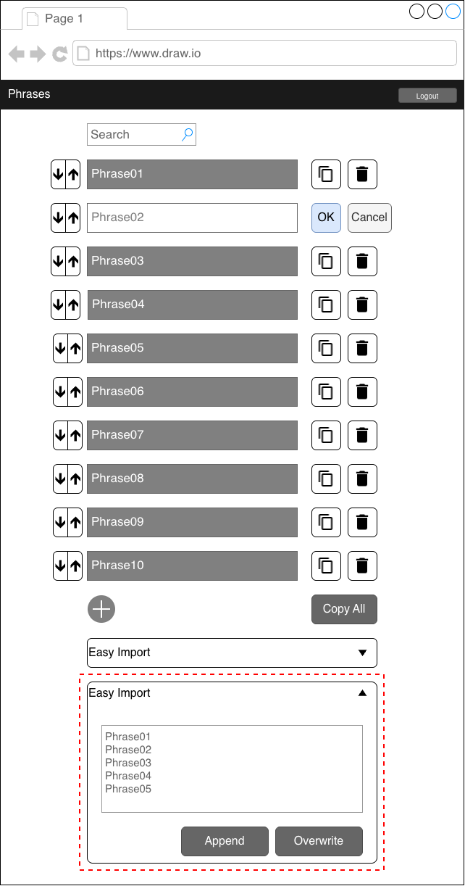

# 02 Screen Design

## 概要

本ドキュメントでは、Phase1で実装する画面の構成および主要なUI要素を定義する。

---

## 画面一覧

| 画面名                                       | 説明                                     |
| -------------------------------------------- | ---------------------------------------- |
| トップ画面: フレーズ一覧画面（未ログイン時） | フレーズの表示・コピー・管理（最大10件） |
| ログイン画面                                 | メールアドレス入力、Magic Link送信       |
| フレーズ一覧画面                             | フレーズの表示・コピー・管理             |

---

## 1. トップ画面: フレーズ一覧画面（未ログイン時）

### 画面イメージ

### UI要素

- タイトル
- ログインボタン
- フレーズリスト（最大10件）
- 各フレーズのコピーボタン
- 各フレーズの削除ボタン
- Copy All ボタン
- フレーズ追加ボタン（+ ボタン）
- 使用数表示（例：8 / 10 used）
- Easy Import ボタン
  - テキスト入力エリア（複数行）
  - Append（追加） ボタン
  - Overwrite（上書き） ボタン
- Append ボタン押下時のダイアログ警告
- Overwrite ボタン押下時のダイアログ警告

### 挙動

- フレーズを10件まで登録可能
- コピーボタンでコピー
- Copy Allで全フレーズを改行区切りでコピー
  - コピーしたものを、メモアプリなどに簡易バックアップ可能
- フレーズをダブルクリックで編集可能
  - 編集可能になると、フレーズ部分がテキストボックスに変化（背景色が変化）
  - コピーボタンが編集確定OKボタン、編集Cancelボタンに変化
  - 登録できるフレーズに改行は想定していない。改行を許容すると、改行区切りでインポートする、という仕様の前提が崩れてしまう。
- フレーズ追加ボタン（+ボタン）を押下すると、最下部に行が追加されて編集状態となり、フレーズを追加できる。
  - フレーズが10個に達するとフレーズ追加ボタンは無効化される。
  - フレーズ追加ボタンの右にフレーズ数上限、使用済みのフレーズ数が表示される。（例: 8 / 10 used）
- Easy Import（簡易インポート）ボタン
  - 改行区切りのテキストからインポートできる。
  - インポート方法は2通り選択可能。アコーディオンボタンを押すと、テキストエリアとボタンが二つ表示される（赤点線枠内）
    - Appendボタンによる追加インポート
    - Overwriteボタンによる上書きインポート
  - Append、Overwrite押下時にはダイアログで警告が出る
  - インポートの後に10行以上となる場合はバリデーションエラーが表示される
    - ログインすると登録、インポートできるフレーズ数に制限がないことをが伝わるようにする。

### 以下スマホ対応

- Webアプリのためスマホ向けにレスポンシブ対応
- ボタンサイズに注意
- フレーズの編集について、スマホの場合はダブルタップできるように留意すること

### 実装想定

- フロントエンドはReactでの実装を想定しており、ログイン前はDBに保存せず、useStateの機能を使用してフレーズを保持する想定

---

## 2. ログイン画面

### 画面イメージ

### UI要素

- メールアドレス入力フィールド
- Magic Link送信ボタン
- ヘッダータイトル: トップ画面へのリンク

### 挙動

- メールアドレス入力後、Magic Linkを送信 // TODO: api/auth
- メール送信済み画面表示
- メール内のリンクをクリック
  - アカウントなしの場合は、アカウントが作成された内容のコメントをメール内に記載
- 認証成功: ログイン完了 // TODO: api/auth
- 認証失敗
  - トークン期限切れ → 「リンクの有効期限が切れています」
  - 不正トークン → 「無効なリンクです」
  - 再ログイン導線を表示

---

## 3. フレーズ一覧画面

トップ画面: フレーズ一覧画面（未ログイン時）との差分のみ表示

### 画面イメージ

### UI要素

- ログアウトボタン
- 検索バー
- フレーズ移動ボタン（矢印ボタン）

### 挙動

- ログインすると、フレーズがDBに登録される仕様となり、再度ログインした時に、前回と同じ状態が読み込まれる
- ログインすると、登録、インポートできるフレーズ数に制限はなくなる
- 次の操作でデータがDBに保存され、再度フレーズ一覧が読み込まれる( // TODO: api/phrase )
  - フレーズ追加ボタン( // TODO: api/phrase )
  - フレーズ編集( // TODO: api/phrase )
  - フレーズ削除ボタン( // TODO: api/phrase )
  - フレーズ移動ボタン( // TODO: api/phrase )
  - Easy Importボタン( // TODO: api/phrase )
    - Appendボタンによる追加インポート
    - Overwriteボタンによる上書きインポート
- ログアウトボタン押下でトップ画面: フレーズ一覧画面（未ログイン時）に戻る
- 検索バーに入力するとフレーズ検索ができる
  - 部分一致
  - リアルタイムフィルタ（フロントエンド、React実装想定）
  - 大文字小文字無視
- フレーズ移動ボタンの矢印を押すと、矢印の方向に応じてフレーズの順番が変えられる( // TODO: api/phrase )
- フレーズ数に制限がないため、フレーズ追加ボタンは無効化されない

---

## 4. 共通仕様

### コピー機能

- クリックでクリップボードにコピー
- コピー成功時のフィードバック
  - ボタン横に「Copied!」表示（1秒）
  - コピーされたフレーズが光るようにハイライトされる
  - 1秒程度経過するとボタン、フレーズ表示ともに元に戻る

### キーボード操作

- Enter：決定
- Esc：キャンセル
- Opt+F / Alt+F: 検索バーにフォーカス

---

## 5. 備考

- UIはシンプルさを重視する
- Phase1では最低限の機能に絞る

